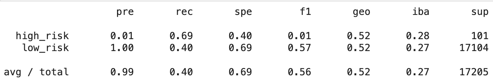

# Credit Risk Analysis

## Project Overivew

Jill would like some machine learning model made from the LendingClub dataset, which happens to be unbalanced. Using oversampling, undersampling, and a combination of the two, the models will be compared to evaulate which performed better. Next, two different models that reduce bias will be created and compared, again, to see which performs better.

## Results

1. Naive Random Oversampling
    - Precision (AVG): 0.99
    - Recall (AVG): 0.61
    - Balanced Accuracy Score: 0.638
    
2. SMOTE Oversampling
    - Precision (AVG): 0.99
    - Recall (AVG): 0.69
    - Balanced Accuracy Score: 0.658
    
3. Cluster Centroid Undersampling
    - Precision (AVG): 0.99
    - Recall (AVG): 0.40
    - Balanced Accuracy Score: 0.544
    
4. SMOTEENN Combination Sampling
    - Precision (AVG): 0.99
    - Recall (AVG): 0.58
    - Balanced Accuracy Score: 0.647
    
5. Random Forest Classifier
    - Precision (AVG): 1.00
    - Recall (AVG): 1.00
    - Balanced Accuracy Score: 0.683
    
6. Easy Ensemble Classifier
    - Precision (AVG): 0.99
    - Recall (AVG): 0.94
    - Balanced Accuracy Score: 0.931
    

Looking at the data, one can see that the first four models and easy ensemble classifier all have an average precision of 0.99. Upon further investigation, one can see that the precision for high risk credit applications for these models are all very low which is also supported by a low f1 score. This means that these models aren't very good at identifying high risk applications. The random forest classifier has a 0.88 precision for high risk, though it has a fairly low sensitivity (recall).

## Summary

In summary, these models do a good job identifying low risk credit appliations, but struggle to identify high risk ones. Some suggestions to potentially improve these models would be to remove the least important features as well as increasing the amount of high risk data to train the models with by either gathering more data naturally or synthetically creating new high risk data.
